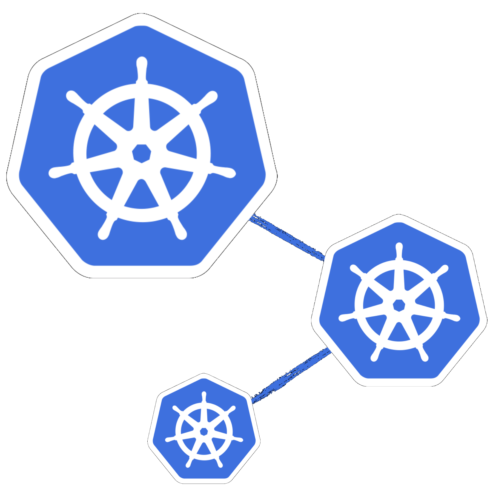

 &nbsp; &nbsp; &nbsp;
 &nbsp; &nbsp; &nbsp;
 &nbsp; &nbsp; &nbsp;

<div style="text-align:center">
	
</div>

# konf-sh - the KubeConfig manager for your shell

**_⚠️ This repo is under active development 🏗_**

- [Why yet another k8s tool?](#why-yet-another-k8s-tool)
- [Description](#description)
- [Install & configure](#install-and-configure)
    - [1. Install binary](#1-install-binary)
    - [2. Install shell wrapper](#2-install-shell-wrapper)
    - [3. Install autocompletion](#3-install-autocompletion)
    - [4. Advised customisations](#4-advised-customisations)
- [Usage](#usage)
- [Some tech details](#some-tech-details)
    - [Flags](#flags)
    - [Environment variables](#environment-variables)
    - [Error codes](#error-codes)
- [Roadmap](#roadmap)
- [Codebase](#codebase)
    - [Build](#build)
    - [Test](#test)

---

## Why yet another k8s tool?

This project was inspired by [kubectx+kubens](https://github.com/ahmetb/kubectx), but that tool doesn't offer 2 must-to-have (in my opinion) features:

- set k8s context just for current shell
- manage k8s configuration file `~/.kube/config`

---

## Description

`konf` makes easier to manage, maintain and use Kubernetes configuration (a.k.a. `~/.kube/config`).

`konf` offers following cool features:

- split k8s configuration into multiple k8s config separate files (one per context)
- list available single k8s config files
- set k8s context for current shell only
- set global k8s context
- view k8s context for current shell
- view global k8s context
- rename k8s context
- delete a specific k8s context
- reset k8s context to default 
- cli autocompletion

---

## Install and configure

### 1. Install binary

`🏗 work in progress`

### 2. Install shell wrapper

#### zsh

Add the following to your `.zshrc` and restart the shell:

```sh
source <(konf-sh shellwrapper zsh)
```

#### bash

Add the following to your `.bashrc` and restart the shell:

```sh
source <(konf-sh shellwrapper bash)
```

### 3. Install autocompletion

Current supported shells: zsh, bash

#### zsh

Add the following to your `.zshrc` and restart the shell:

```sh
source <(konf completion zsh)
```

#### bash

Add the following to your `.bashrc` and restart the shell:

```sh
source <(konf completion bash)
```

### 4. Advised customisations

Here following some optional customisations to make your life even easier.

#### Open last konf used

Add the following to your `.zshrc` or `.bashrc` and restart the shell:

```sh
export KUBECONFIG=$(konf --silent set -)
```

#### Aliases

Add the following to your `.zshrc` or `.bashrc` and restart the shell:

```sh
alias kctx="konf set"
alias kns="konf ns"
```

---

## Usage

### Split

`konf split` separates the Kubernetes configuration (by default `~/.kube/config`) into single Kubernetes konfigurations files (by default in `~/.kube/konfigs`).

### List

`konf list` lists all single Kubernetes konfigurations files separated by `konf split` (by default in `~/.kube/konfigs`).

### Set

`konf set local <context>` sets the local (current shell) Kubernetes context (setting `KUBECONFIG` environment variable) to the specified one (by default `~/.kube/konfigs`).

`konf set global <context>` sets the global Kubernetes context (by default `currentContext` in `~/.kube/config`) to the specified one (by default `~/.kube/konfigs`).

### View

`konf view` shows both local (current shell) and global Kubernetes context.

`konf view local` shows only the local (current shell) Kubernetes context.

`konf view global` shows only the global Kubernetes context.

### Rename

`konf rename <context-to-rename> <new-context-name>` renames the specified context in both Kubernetes configuration (by default in `~/.kube/config`) and single Kubernetes konfigurations (by default in `~/.kube/konfigs`).

### Delete

`konf delete <context-list>` removes the specified comma-separated context list from both Kubernetes configuration (by default `~/.kube/config`) and single Kubernetes konfigurations (by default in `~/.kube/konfigs`).

### Reset

`konf reset local` resets the local (current shell) Kubernetes configuration (unsetting `KUBECONFIG` environment variable).

`konf reset global` resets global Kubernetes context to N/A (by default `currentContext` in `~/.kube/config`).

### Completion

`konf completion [zsh | bash]` outputs the autocompletion script for the selected shell.

### Help

`konf help` shows the helper.

### Version

`konf version` shows the version.

---

## Some tech details

### Flags

| Flag             | Command list                         | Available values | Default              | Corresponding env-var         | Description                                             |
|:-----------------|:-------------------------------------|:-----------------|:---------------------|:------------------------------|:--------------------------------------------------------|
| --kube-config    | split, view, view global, set global | -                | $HOME/.kube/config   | KONF_KUBE_CONFIG_PATH         | Specify a custom Kubernetes configuration file path     |
| --single-konfigs | split, list, set local, set global   | -                | $HOME/.kube/konfigs/ | KONF_SINGLE_KUBE_CONFIGS_PATH | Specify the single Kubernetes konfigurations files path |

### Environment variables

| Key                           | Command list                         | Available values                | Default              | Corresponding flag | Description                                             |
|:------------------------------|:-------------------------------------|:--------------------------------|:---------------------|:-------------------|:--------------------------------------------------------|
| KONF_LOG_ENCODING             | (global)                             | console, json                   | console              | -                  | Set logger encoding                                     |
| KONF_LOG_LEVEL                | (global)                             | debug, info, warn, error, fatal | info                 | -                  | Set logger level                                        |
| KONF_KUBE_CONFIG_PATH         | split, view, view global, set global | -                               | $HOME/.kube/config   | --kube-config      | Specify a custom Kubernetes configuration file path     |
| KONF_SINGLE_KUBE_CONFIGS_PATH | split, list, set local, set global   | -                               | $HOME/.kube/konfigs/ | --single-konfigs   | Specify the single Kubernetes konfigurations files path |

### Error codes

| Code | Command                           | Description                                                                                                              |
|:-----|:----------------------------------|:-------------------------------------------------------------------------------------------------------------------------|
| 1    | (all)                             | Error initializing zap logger                                                                                            |
| 2    | (all)                             | Error starting application                                                                                               |
| 3    | (all)                             | Error creating specific application command                                                                              |
| 11   | split                             | Error checking existence of Kubernetes konfigurations files path                                                         |
| 12   | split, set global, delete, rename | Error validating Kubernetes configuration (single, global, cleaned)                                                      |
| 13   | split, set global, delete, rename | Error writing Kubernetes configuration (single, global, cleaned) to file                                                 |
| 21   | list                              | Error listing single Kubernetes konfigurations                                                                           |
| 31   | set local                         | Error checking existence of Kubernetes konfigurations files path                                                         |
| 32   | set local, set global             | Error getting Kubernetes context: context argument not specified                                                         |
| 33   | set local                         | Error checking existence of Kubernetes context                                                                           |
| 34   | set global, rename                | Error checking existence of context in Kubernetes configuration                                                          |
| 41   | delete                            | Error getting Kubernetes context list: 'context list' argument not specified                                             |
| 42   | delete                            | Error validating Kubernetes context list: 'context list' argument not valid. Context list must be a comma-separated list |
| 43   | delete                            | Error cleaning Kubernetes context list                                                                                   |
| 51   | rename                            | Error getting Kubernetes context to rename: 'context to rename' and 'new context name' arguments not specified           |
| 52   | rename                            | Error getting Kubernetes context to rename: 'context to rename' argument not specified                                   |
| 53   | rename                            | Error getting Kubernetes context to rename: 'new context name' argument not specified                                    |
| 54   | rename                            | Error removing context from Kubernetes configuration                                                                     |

---

## Roadmap

See [here](docs/roadmap.md).

---

## Codebase

### Build

```sh
git clone git@github.com:bygui86/konf.git

cd konf

make build
```

### Test

`🏗 work in progress`
